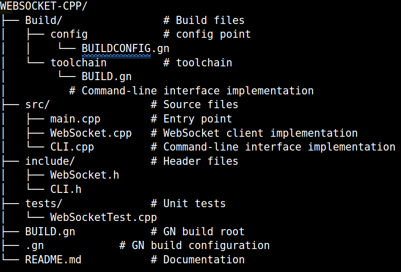

# WebSocket Cpp
 


### Folder Structure: 



in src run : 
```
g++ main.cpp WebSocket.cpp CLI.cpp -o websocket_client -lboost_system -lpthread -lssl -lcrypto
```


Build:

```
proj/src$ gn gen out/release --args="is_debug=false"
Done. Made 5 targets from 3 files in 3ms

proj/src$ ninja -C out/release
ninja: Entering directory `out/release'
[9/9] STAMP obj/all.stamp
```

```
proj/src$ gn gen out/debug --args="is_debug=true"
Done. Made 5 targets from 3 files in 3ms

proj/src$ ninja -C out/debug
ninja: Entering directory `out/debug'
[9/9] STAMP obj/all.stamp
```
